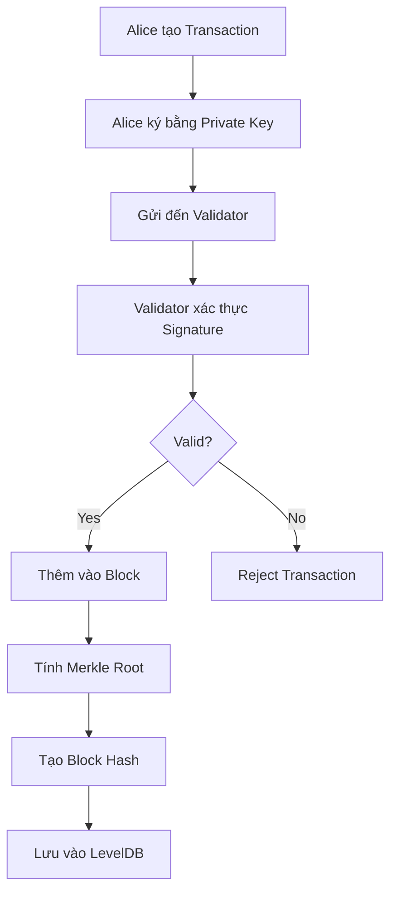

# 🎯 Blockchain Cheat Sheet - Các Khái Niệm Quan Trọng

## 🔑 Thuật Ngữ Cơ Bản

| Thuật Ngữ       | Giải Thích                            | Ví Dụ                                      |
| --------------- | ------------------------------------- | ------------------------------------------ |
| **Private Key** | Khóa bí mật để ký giao dịch           | `d4f3c2b1a5e6...` (256 bits)               |
| **Public Key**  | Khóa công khai, tính từ private key   | `(X, Y)` coordinates trên elliptic curve   |
| **Address**     | Địa chỉ ví, hash của public key       | `4d47ace7bbcdde1ec0dda61bf0600f3c22221dbc` |
| **Transaction** | Giao dịch chuyển tiền                 | Alice → Bob: 50 coins                      |
| **Signature**   | Chữ ký chứng minh quyền sở hữu        | `(r, s)` values                            |
| **Block**       | Nhóm giao dịch được gói lại           | Chứa 1-1000 transactions                   |
| **Hash**        | Mã băm duy nhất                       | SHA-256: 64 ký tự hex                      |
| **Merkle Root** | Hash tổng hợp của tất cả transactions | Gốc của Merkle Tree                        |
| **Blockchain**  | Chuỗi các blocks liên kết             | Block0 → Block1 → Block2...                |

## 🔐 ECDSA Digital Signature

### Tạo Chữ Ký:

```
1. Hash transaction: h = SHA256(transaction)
2. Ký hash: (r, s) = ECDSA_Sign(private_key, h)
3. Lưu signature: transaction.signature = (r, s)
```

### Xác Thực Chữ Ký:

```
1. Hash transaction: h = SHA256(transaction without signature)
2. Xác thực: valid = ECDSA_Verify(public_key, h, (r, s))
```

## 🌳 Merkle Tree

### Cách Xây Dựng:

```
Transactions: [Tx1, Tx2, Tx3, Tx4]
             ↓
Step 1: Hash each → [H1, H2, H3, H4]
Step 2: Pair & Hash → [H12, H34] where H12 = SHA256(H1+H2)
Step 3: Final Hash → H1234 = SHA256(H12+H34)
Result: Merkle Root = H1234
```

### Lợi Ích:

- ✅ **Integrity**: Phát hiện thay đổi bất kỳ transaction nào
- ✅ **Efficiency**: Chỉ cần lưu 1 hash thay vì nhiều
- ✅ **Proof**: Chứng minh transaction có trong block

## 🧱 Block Structure

```json
{
  "index": 1,
  "timestamp": 1640995200,
  "transactions": [
    {
      "sender": "alice_address",
      "receiver": "bob_address",
      "amount": 50.0,
      "signature": "..."
    }
  ],
  "merkle_root": "9250bad8341649f0...",
  "previous_block_hash": "d9050ddddd56fb95...",
  "current_block_hash": "ce3a142a4d34cad6..."
}
```

## 🔗 Blockchain Linking

```
Genesis Block (Index: 0)
└── Hash: ABC123
    ↓
Block 1 (Index: 1)
├── Previous Hash: ABC123  ← Links to Genesis
└── Hash: DEF456
    ↓
Block 2 (Index: 2)
├── Previous Hash: DEF456  ← Links to Block 1
└── Hash: GHI789
```

## 💾 LevelDB Storage

### Key-Value Pairs:

```
Key: block_hash → Value: serialized_block
Key: "index_1" → Value: block_hash
Key: "index_2" → Value: block_hash
```

### Lợi Ích:

- **Fast Lookup**: Tìm block theo hash hoặc index
- **Persistent**: Dữ liệu không mất khi restart
- **Ordered**: Keys được sắp xếp tự động

## ⚡ Transaction Flow



## 🎮 CLI Commands

| Command  | Mô Tả               | Example                             |
| -------- | ------------------- | ----------------------------------- |
| `create` | Tạo wallet mới      | `./cli.exe create`                  |
| `send`   | Gửi tiền            | `./cli.exe send <address> <amount>` |
| `demo`   | Chạy demo Alice-Bob | `./cli.exe demo`                    |
| `help`   | Hiển thị trợ giúp   | `./cli.exe help`                    |

## 🔍 Debugging Tips

### Kiểm tra Transaction:

```bash
# Hash của transaction phải giống nhau khi verify
echo "Transaction: $(cat transaction.json | sha256sum)"
```

### Kiểm tra Signature:

```go
// Debug signature verification
fmt.Printf("TX Hash: %x\n", tx.Hash())
fmt.Printf("Signature: %x\n", tx.Signature)
fmt.Printf("Public Key: %x,%x\n", pubKey.X, pubKey.Y)
```

### Kiểm tra Merkle Tree:

```go
// So sánh merkle root trước/sau thay đổi
fmt.Printf("Original Root: %x\n", originalRoot)
fmt.Printf("New Root: %x\n", newRoot)
```

## ⚠️ Common Pitfalls

1. **Signature trong Hash**: Đừng include signature khi tính hash của transaction
2. **Key Serialization**: JSON marshal/unmarshal ECDSA keys cần custom logic
3. **Odd Number Merkle**: Duplicate node cuối nếu số lượng lẻ
4. **Block Linking**: Đảm bảo previous_hash đúng khi tạo block mới

## 🎯 Security Checklist

- ✅ Private keys không được hardcode
- ✅ Signature verification trước khi accept transaction
- ✅ Hash integrity cho blocks và transactions
- ✅ Proper random number generation cho keys
- ✅ Input validation cho amounts và addresses

## 📊 Performance Notes

| Operation         | Complexity | Notes               |
| ----------------- | ---------- | ------------------- |
| Generate Key      | O(1)       | Fast với P256 curve |
| Sign Transaction  | O(1)       | ECDSA signing       |
| Verify Signature  | O(1)       | ECDSA verification  |
| Build Merkle Tree | O(n)       | n = số transactions |
| Save/Load Block   | O(1)       | LevelDB lookup      |

## 🚀 Next Steps

1. **Add Balance Tracking**: Implement UTXO hoặc account model
2. **Network Layer**: P2P communication giữa nodes
3. **Consensus**: Implement PoW hoặc PoS
4. **Smart Contracts**: Programmable transactions
5. **Optimization**: Bloom filters, compression
6. **Security Audit**: Formal verification
