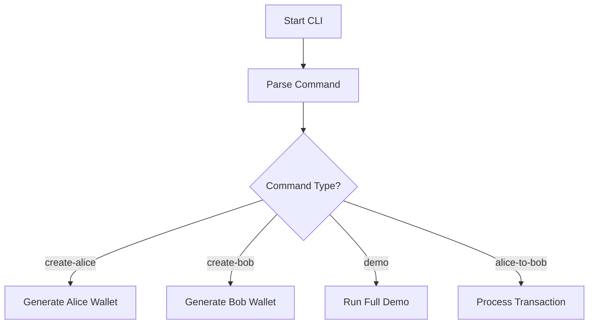
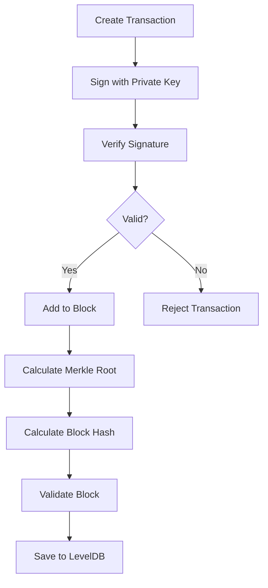
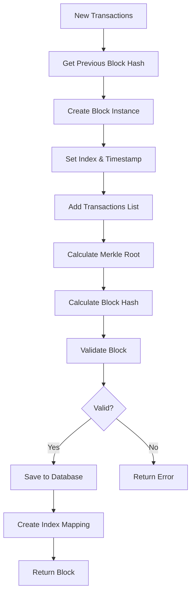

# 📚 Hướng Dẫn Hiểu Code Blockchain - Dành Cho Người Mới Bắt Đầu

## 📖 Mục Lục

1. [Tổng Quan Dự Án](#tổng-quan-dự-án)
2. [Cấu Trúc Thư Mục](#cấu-trúc-thư-mục)
3. [Giải Thích Chi Tiết Từng File](#giải-thích-chi-tiết-từng-file)
4. [Khái Niệm Blockchain Cơ Bản](#khái-niệm-blockchain-cơ-bản)
5. [Luồng Hoạt Động](#luồng-hoạt-động)
6. [Demo và CLI Usage](#demo-và-cli-usage)

---

## 🎯 Tổng Quan Dự Án

Dự án này là một **blockchain đơn giản** được viết bằng Go, tập trung vào các yêu cầu cốt lõi của blockchain:

### ✅ Tính Năng Chính

- **📝 Danh sách giao dịch**: Mỗi block chứa tập hợp các giao dịch hợp lệ
- **🌳 Merkle Root**: Xác thực tính toàn vẹn của tất cả giao dịch
- **🔗 Previous Block Hash**: Liên kết các block tạo thành chuỗi
- **🔐 Current Block Hash**: Hash duy nhất của block hiện tại
- **✍️ ECDSA Digital Signatures**: Ký số và xác thực giao dịch
- **💾 LevelDB Storage**: Lưu trữ bền vững và hiệu quả
- **🖥️ CLI Interface**: Giao diện dòng lệnh thân thiện

---

## 📁 Cấu Trúc Thư Mục

```
blockchain-go/
├── 🚀 cmd/main.go               # CLI chính - điểm vào chương trình
├── 📦 pkg/
│   ├── blockchain/              # Logic blockchain cốt lõi
│   │   ├── block.go            # Định nghĩa Block và tạo block
│   │   ├── transaction.go      # Định nghĩa Transaction và hash
│   │   └── merkle.go           # Merkle Tree implementation
│   ├── wallet/                 # Quản lý ví và chữ ký
│   │   ├── key.go             # Tạo khóa và địa chỉ ví
│   │   └── sign.go            # Ký và xác thực giao dịch
│   ├── storage/                # Lưu trữ dữ liệu
│   │   └── leveldb.go         # LevelDB operations
│   ├── validator/              # Node xác thực
│   │   └── node.go            # Tạo và validate blocks
│   └── utils/                  # Tiện ích
│       └── hash.go            # Hàm hash utilities
├── 🔑 alice_key.json           # Ví của Alice
├── 🔑 bob_key.json             # Ví của Bob
├── 🏃 run.bat                  # Script chạy demo
├── 🔧 cli.exe                  # Executable đã build
├── 📁 blockchain_data/         # Database chính
└── 📁 demo_blockchain/         # Database demo
```

---

## 🔍 Giải Thích Chi Tiết Từng File

### 1. 🔑 pkg/wallet/key.go - Quản Lý Khóa Mật Mã

```go
package wallet

import (
    "crypto/ecdsa"
    "crypto/elliptic"
    "crypto/rand"
    "crypto/sha256"
)
```

**Giải thích import:**

- `crypto/ecdsa`: Thuật toán ký số ECDSA (Elliptic Curve Digital Signature Algorithm)
- `crypto/elliptic`: Đường cong elliptic cho mật mã học
- `crypto/rand`: Tạo số ngẫu nhiên an toàn
- `crypto/sha256`: Hàm hash SHA-256

```go
func GenerateKeyPair() (*ecdsa.PrivateKey, error) {
    return ecdsa.GenerateKey(elliptic.P256(), rand.Reader) // xài đường cong elliptic.P256() để tạo khóa
}
```

**Giải thích:**

- **Private Key**: Khóa riêng tư, dùng để ký giao dịch
- **Public Key**: Khóa công khai, được tính từ private key
- **P256**: Đường cong elliptic tiêu chuẩn, an toàn và hiệu quả
- **rand.Reader**: Nguồn entropy an toàn cho việc tạo khóa

```go
func PublicKeyToAddress(pubKey *ecdsa.PublicKey) []byte {
    pubBytes := append(pubKey.X.Bytes(), pubKey.Y.Bytes()...) // nghiên cứu thêm
    hash := sha256.Sum256(pubBytes)
    return hash[:20]
}
```

**Giải thích:**

- **Address**: Địa chỉ ví, tính từ public key (20 bytes đầu của SHA-256 hash)
- **X, Y**: Tọa độ của điểm trên đường cong elliptic
- **SHA-256**: Hash công khai để tạo address duy nhất
- **[:20]**: Lấy 20 bytes = 160 bits cho address (giống Ethereum)

- **Address**: Địa chỉ ví, tính từ public key
- **X, Y**: Tọa độ của điểm trên đường cong elliptic
- **SHA-256**: Hash công khai để tạo address duy nhất
- **[:20]**: Lấy 20 bytes = 160 bits cho address

---

### 2. ✍️ pkg/wallet/sign.go - Ký Số và Xác Thực

```go
func SignTransaction(tx *blockchain.Transaction, privKey *ecdsa.PrivateKey) error {
    hash, _ := tx.Hash()  // Lấy hash của transaction
    r, s, err := ecdsa.Sign(rand.Reader, privKey, hash)  // Ký hash
    if err != nil {
        return fmt.Errorf("sign error: %w", err)
    }

    tx.Signature = append(r.Bytes(), s.Bytes()...)  // Ghép r và s
    return nil
}
```

**Giải thích ECDSA Signing:**

- **Hash trước khi ký**: Chỉ ký hash, không ký toàn bộ dữ liệu
- **r, s**: Hai thành phần của chữ ký ECDSA
- **Deterministic**: Cùng private key + hash → có thể tạo ra chữ ký khác nhau do random
- **Non-repudiation**: Chỉ chủ private key mới tạo được chữ ký hợp lệ

```go
func VerifyTransaction(tx *blockchain.Transaction, pubKey *ecdsa.PublicKey) bool {
    hash, _ := tx.Hash()  // Tạo lại hash của transaction
    r := new(big.Int).SetBytes(tx.Signature[:len(tx.Signature)/2])  // Tách r
    s := new(big.Int).SetBytes(tx.Signature[len(tx.Signature)/2:])  // Tách s
    return ecdsa.Verify(pubKey, hash, r, s)  // Xác thực
}
```

**Giải thích Verification:**

- **Public Key Verification**: Dùng public key để xác thực
- **Hash Matching**: Hash phải giống khi ký
- **Mathematical Proof**: Chứng minh toán học chủ private key đã ký

---

### 3. 💰 pkg/blockchain/transaction.go - Giao Dịch

```go
type Transaction struct {
    Sender    []byte // Public Key or Address
    Receiver  []byte // Public Key or Address
    Amount    float64
    Timestamp int64
    Signature []byte // R and S concatenated
}
```

**Giải thích các trường:**

- **Sender/Receiver**: Địa chỉ ví (20 bytes từ public key hash)
- **Amount**: Số tiền chuyển (trong thực tế dùng integer cho độ chính xác)
- **Timestamp**: Unix timestamp, chống replay attack
- **Signature**: Chữ ký ECDSA chứng minh quyền sở hữu

```go
func (t *Transaction) Hash() ([]byte, error) {
    txCopy := *t           // Copy ra để không thay đổi transaction gốc
    txCopy.Signature = nil // Loại bỏ signature
    data, err := json.Marshal(txCopy)
    if err != nil {
        return nil, fmt.Errorf("failed to marshal transaction: %w", err)
    }
    hash := sha256.Sum256(data)
    // Đặc điểm SHA-256:
    // Deterministic: cùng input → cùng output
    // Irreversible: không thể reverse từ hash về data
    // Collision resistant: rất khó tìm 2 input có cùng hash
    return hash[:], nil
}
```

**Tại sao loại bỏ Signature khi hash?**

- **Circular Dependency**: Signature được tính từ hash, nếu hash bao gồm signature sẽ bị lặp vô hạn
- **Immutable Content**: Hash chỉ phản ánh nội dung giao dịch, không phải chữ ký

---

### 4. 🌳 pkg/blockchain/merkle.go - Cây Merkle

```go
// MerkleTree tối giản cho xác thực tính toàn vẹn
type MerkleTree struct {
    Root []byte
}
```

**Merkle Tree là gì?**

- **Binary Tree**: Cây nhị phân, mỗi node có tối đa 2 con
- **Hash-based**: Mỗi node chứa hash của các node con
- **Root Hash**: Hash ở đỉnh đại diện cho toàn bộ cây
- **Tamper Detection**: Thay đổi bất kỳ leaf nào sẽ thay đổi root

```go
func NewMerkleTree(txHashes [][]byte) *MerkleTree {
    if len(txHashes) == 0 {
        return &MerkleTree{Root: nil}
    }

    nodes := txHashes

    // Build tree bottom-up (từ dưới lên)
    for len(nodes) > 1 {
        var level [][]byte

        for i := 0; i < len(nodes); i += 2 {
            left := nodes[i]
            var right []byte

            if i+1 < len(nodes) {
                right = nodes[i+1]
            } else {
                right = left // Duplicate if odd number
            }

            // Combine and hash
            combined := append(left, right...)
            hash := sha256.Sum256(combined)
            level = append(level, hash[:])
        }
        nodes = level
    }

    return &MerkleTree{Root: nodes[0]}
}
```

**Giải thích thuật toán:**

1. **Bắt đầu từ leaves**: Mỗi transaction hash là một leaf
2. **Pair-wise hashing**: Ghép đôi và hash các node
3. **Handle odd numbers**: Nếu lẻ, duplicate node cuối
4. **Bottom-up**: Lặp cho đến khi còn 1 node (root)
5. **SHA-256**: Dùng SHA-256 để hash mỗi cặp

**Ví dụ với 4 transactions:**

```
        Root
       /    \
    H12      H34
   /  \     /  \
  H1   H2  H3   H4
  |    |   |    |
 TX1  TX2 TX3  TX4
```

---

### 5. 📦 pkg/blockchain/block.go - Block Structure

```go
// Block theo yêu cầu: danh sách giao dịch, Merkle Root, PreviousBlockHash, CurrentBlockHash
type Block struct {
    Index             int            `json:"index"`
    Timestamp         int64          `json:"timestamp"`
    Transactions      []*Transaction `json:"transactions"`      // DANH SÁCH GIAO DỊCH
    MerkleRoot        []byte         `json:"merkle_root"`
    PreviousBlockHash []byte         `json:"previous_block_hash"`
    CurrentBlockHash  []byte         `json:"current_block_hash"`
}
```

**🎯 4 Yêu Cầu Cốt Lõi:**

1. **📝 Danh sách giao dịch** (`Transactions`): Tập hợp các giao dịch hợp lệ
2. **🌳 Merkle Root** (`MerkleRoot`): Hash đại diện cho tất cả transactions
3. **🔗 Previous Block Hash** (`PreviousBlockHash`): Liên kết với block trước
4. **🔐 Current Block Hash** (`CurrentBlockHash`): Hash duy nhất của block này

```go
// NewBlock tạo block mới theo yêu cầu tối giản
func NewBlock(index int, transactions []*Transaction, prevHash []byte) *Block {
    block := &Block{
        Index:             index,
        Timestamp:         time.Now().Unix(),
        Transactions:      transactions,        // Lưu danh sách giao dịch
        PreviousBlockHash: prevHash,           // Link với block trước
    }

    // Tính Merkle Root từ transactions
    block.calculateMerkleRoot()

    // Tính Current Block Hash
    block.calculateHash()

    return block
}
```

**Quy trình tạo Block:**

1. **Khởi tạo**: Tạo block với transactions và previous hash
2. **Merkle Root**: Tính toán từ tất cả transaction hashes
3. **Block Hash**: Tính hash của toàn bộ block data
4. **Validation**: Kiểm tra tính hợp lệ trước khi lưu

```go
// calculateMerkleRoot tính Merkle Root từ transactions
func (b *Block) calculateMerkleRoot() {
    if len(b.Transactions) == 0 {
        b.MerkleRoot = []byte{}
        return
    }

    // Lấy hash của tất cả transactions
    var txHashes [][]byte
    for _, tx := range b.Transactions {
        hash, err := tx.Hash()
        if err != nil {
            continue
        }
        txHashes = append(txHashes, hash)
    }

    // Tạo Merkle Tree và lấy root
    merkleTree := NewMerkleTree(txHashes)
    b.MerkleRoot = merkleTree.GetRoot()
}
```

**Tại sao cần Merkle Root?**

- **Integrity Check**: Kiểm tra không có transaction nào bị thay đổi
- **Efficient Verification**: Chỉ cần so sánh 1 hash thay vì tất cả transactions
- **Tamper Evidence**: Thay đổi bất kỳ transaction nào sẽ thay đổi Merkle Root

```go
// calculateHash tính Current Block Hash
func (b *Block) calculateHash() {
    // Tạo struct chỉ chứa data cần hash (không bao gồm CurrentBlockHash)
    blockData := struct {
        Index             int            `json:"index"`
        Timestamp         int64          `json:"timestamp"`
        Transactions      []*Transaction `json:"transactions"`
        MerkleRoot        []byte         `json:"merkle_root"`
        PreviousBlockHash []byte         `json:"previous_block_hash"`
    }{
        Index:             b.Index,
        Timestamp:         b.Timestamp,
        Transactions:      b.Transactions,
        MerkleRoot:        b.MerkleRoot,
        PreviousBlockHash: b.PreviousBlockHash,
    }

    data, err := json.Marshal(blockData)
    if err != nil {
        return
    }

    hash := sha256.Sum256(data)
    b.CurrentBlockHash = hash[:]
}
```

**Tại sao không hash CurrentBlockHash?**

- **Circular Reference**: CurrentBlockHash là kết quả của việc hash, không thể tự hash chính nó
- **Deterministic**: Cùng block data → cùng hash

---

### 6. 🔍 Block Validation - Xác Thực Block

```go
// IsValid kiểm tra tính hợp lệ của block theo yêu cầu
func (b *Block) IsValid() bool {
    // 1. Kiểm tra Merkle Root integrity
    var txHashes [][]byte
    for _, tx := range b.Transactions {
        hash, err := tx.Hash()
        if err != nil {
            return false
        }
        txHashes = append(txHashes, hash)
    }

    merkleTree := NewMerkleTree(txHashes)
    calculatedRoot := merkleTree.GetRoot()

    // 2. So sánh calculated vs stored Merkle Root
    if len(calculatedRoot) != len(b.MerkleRoot) {
        return false
    }
    for i := range calculatedRoot {
        if calculatedRoot[i] != b.MerkleRoot[i] {
            return false
        }
    }

    // 3. Kiểm tra Current Block Hash integrity
    originalHash := make([]byte, len(b.CurrentBlockHash))
    copy(originalHash, b.CurrentBlockHash)

    b.calculateHash()

    for i := range originalHash {
        if originalHash[i] != b.CurrentBlockHash[i] {
            return false
        }
    }

    return true
}
```

**Validation Process:**

1. **Merkle Root Check**: Tính lại Merkle Root từ transactions và so sánh
2. **Block Hash Check**: Tính lại block hash và so sánh
3. **Data Integrity**: Đảm bảo không có dữ liệu nào bị thay đổi

### 7. 🏛️ pkg/validator/node.go - Validator Node

```go
// ValidatorNode đơn giản - chỉ tập trung vào yêu cầu đề bài:
// - Lưu trữ blocks trong LevelDB
// - Xác thực bằng Merkle Tree
type ValidatorNode struct {
    storage *storage.BlockStorage
}
```

**Validator Node nhiệm vụ:**

- **Create Blocks**: Tạo block mới từ transactions
- **Validate Blocks**: Kiểm tra tính hợp lệ bằng Merkle Tree
- **Store Blocks**: Lưu trữ vào LevelDB

```go
// CreateBlock tạo block mới từ transactions (core functionality)
func (vn *ValidatorNode) CreateBlock(transactions []*blockchain.Transaction) (*blockchain.Block, error) {
    // Lấy previous block hash nếu có
    var prevHash []byte
    latestIndex, err := vn.storage.GetLatestIndex()
    if err == nil && latestIndex >= 0 {
        prevBlock, err := vn.storage.GetBlockByIndex(latestIndex)
        if err == nil {
            prevHash = prevBlock.CurrentBlockHash  // Link to previous block
        }
    }

    // Tạo block mới
    newBlock := blockchain.NewBlock(latestIndex+1, transactions, prevHash)

    // Xác thực bằng Merkle Tree (yêu cầu đề bài)
    if !newBlock.IsValid() {
        return nil, fmt.Errorf("block invalid - Merkle Tree verification failed")
    }

    // Lưu trữ vào LevelDB (yêu cầu đề bài)
    if err := vn.storage.SaveBlock(newBlock); err != nil {
        return nil, fmt.Errorf("failed to save block: %w", err)
    }

    // Lưu index mapping
    if err := vn.storage.StoreBlockByIndex(newBlock); err != nil {
        return nil, fmt.Errorf("failed to store block index: %w", err)
    }

    return newBlock, nil
}
```

**Block Creation Flow:**

1. **Get Previous Hash**: Lấy hash của block trước đó
2. **Create New Block**: Khởi tạo block với transactions
3. **Validate**: Kiểm tra Merkle Tree và block hash
4. **Store**: Lưu vào LevelDB
5. **Index**: Tạo mapping index → hash để tìm kiếm nhanh

### 8. 💾 pkg/storage/leveldb.go - Database Storage

```go
// BlockStorage quản lý việc lưu trữ blocks trong LevelDB
type BlockStorage struct {
    db *leveldb.DB
}
```

**LevelDB Features:**

- **Key-Value Store**: Lưu trữ dạng key-value
- **Persistent**: Dữ liệu không mất khi restart
- **Fast**: Tối ưu cho read/write operations
- **Embedded**: Không cần database server riêng

```go
// SaveBlock lưu block vào LevelDB với block hash làm key
func (bs *BlockStorage) SaveBlock(block *blockchain.Block) error {
    blockBytes, err := json.Marshal(block)  // Serialize to JSON
    if err != nil {
        return fmt.Errorf("failed to marshal block: %w", err)
    }

    // Sử dụng CurrentBlockHash làm key
    return bs.db.Put(block.CurrentBlockHash, blockBytes, nil)
}
```

**Storage Strategy:**

- **Hash as Key**: Dùng block hash làm primary key
- **JSON Serialization**: Serialize block thành JSON
- **Dual Indexing**: Lưu cả hash-based và index-based lookup

```go
// StoreBlockByIndex lưu block với index làm key (để tìm theo height)
func (bs *BlockStorage) StoreBlockByIndex(block *blockchain.Block) error {
    key := "height_" + strconv.Itoa(block.Index)

    // Chỉ lưu hash, không lưu toàn bộ block để tiết kiệm space
    return bs.db.Put([]byte(key), block.CurrentBlockHash, nil)
}
```

**Index Mapping:**

- **Height → Hash**: Mapping từ block height sang block hash
- **Space Efficient**: Chỉ lưu hash, không duplicate block data
- **Fast Lookup**: Tìm block theo index O(1)

```

---

## 🔗 Khái Niệm Blockchain Cơ Bản

### 1. **Digital Signature (Chữ Ký Số)**

```

Private Key → Sign Transaction → Signature
Public Key + Signature + Transaction → Verify → True/False

```

### 2. **Hash Function (Hàm Hash)**

```

Input: "Hello World"
SHA-256: a591a6d40bf420404a011733cfb7b190d62c65bf0bcda32b57b277d9ad9f146e

```

**Tính chất:**

- **Deterministic**: Cùng input → cùng output
- **Fixed Size**: Output luôn 256 bits
- **Avalanche Effect**: Thay đổi 1 bit input → thay đổi hoàn toàn output

### 3. **Merkle Tree**

```

      Root Hash
     /         \

Hash12 Hash34
/ \ / \
Hash1 Hash2 Hash3 Hash4
| | | |
Tx1 Tx2 Tx3 Tx4

```

### 4. **Blockchain Structure**

```

Block 0 (Genesis)
├── Index: 0
├── Transactions: []
├── PrevHash: null
└── Hash: ABC123

Block 1
├── Index: 1
├── Transactions: [Tx1, Tx2]
├── PrevHash: ABC123 ← Links to Block 0
└── Hash: DEF456

Block 2
├── Index: 2
├── Transactions: [Tx3]
├── PrevHash: DEF456 ← Links to Block 1
└── Hash: GHI789

````

---

## 🔄 Luồng Hoạt Động

### 1. **Tạo Wallet**

```go
// Tạo private key
privKey := GenerateKeyPair()

// Tính public key (tự động từ private key)
pubKey := privKey.PublicKey

// Tạo address từ public key
address := SHA256(pubKey.X + pubKey.Y)[:20]
````

### 2. **Tạo Transaction**

```go
// Tạo transaction
tx := Transaction{
    Sender: aliceAddress,
    Receiver: bobAddress,
    Amount: 50.0,
    Timestamp: now(),
}

// Alice ký transaction
signature := ECDSA_Sign(alicePrivateKey, SHA256(tx))
tx.Signature = signature
```

### 3. **Xác Thực Transaction**

```go
// Validator kiểm tra
txHash := SHA256(tx without signature)
isValid := ECDSA_Verify(alicePublicKey, txHash, tx.Signature)
```

### 4. **Tạo Block**

```go
// Thu thập transactions
transactions := [tx1, tx2, tx3]

// Tạo Merkle Tree
merkleRoot := BuildMerkleTree(transactions)

// Tạo block
block := Block{
    Index: currentIndex,
    Transactions: transactions,
    MerkleRoot: merkleRoot,
    PreviousHash: lastBlock.Hash,
    Timestamp: now(),
}

// Tính hash cho block
block.Hash = SHA256(block)
```

### 5. **Lưu Trữ**

```go
// Lưu vào LevelDB
levelDB.Put(block.Hash, serialize(block))
levelDB.Put("index_" + block.Index, block.Hash)
```

---

## 🎓 Bài Tập Thực Hành

### Bài 1: **Hash Experiment**

```bash
# Thử thay đổi 1 ký tự và xem hash thay đổi như thế nào
echo "Hello World" | sha256sum
echo "Hello World!" | sha256sum
```

### Bài 2: **Signature Verification**

```go
// Tạo transaction và thử thay đổi amount
// Xem signature còn valid không?
tx.Amount = 100.0 // Thay đổi sau khi ký
isValid := VerifyTransaction(tx, publicKey) // Should be false
```

### Bài 3: **Merkle Tree Analysis**

```go
// So sánh Merkle Root trước và sau khi thay đổi 1 transaction
```

---

## 🚀 Mở Rộng Kiến Thức

### 1. **Consensus Mechanisms**

- **Proof of Work**: Mining, difficulty adjustment
- **Proof of Stake**: Validators, staking rewards
- **PBFT**: Byzantine fault tolerance

### 2. **Advanced Features**

- **Smart Contracts**: Programmable transactions
- **UTXO Model**: Unspent transaction outputs
- **Lightning Network**: Layer 2 scaling

### 3. **Security Considerations**

- **51% Attack**: Majority control
- **Double Spending**: Prevent same coin spending twice
- **Replay Attacks**: Timestamp protection

---

## 📚 Tài Liệu Tham Khảo

1. **Bitcoin Whitepaper** - Satoshi Nakamoto
2. **Mastering Bitcoin** - Andreas Antonopoulos
3. **Ethereum Yellowpaper** - Gavin Wood
4. **Cryptography Engineering** - Ferguson, Schneier, Kohno

---

_📝 File này được tạo để giúp người mới bắt đầu hiểu rõ cách blockchain hoạt động thông qua code thực tế. Hãy đọc từng phần một cách cẩn thận và thực hành các ví dụ!_

## 🚀 Demo và CLI Usage

### CLI Commands Available

```bash
# Tạo wallet cho user
cli.exe create

# Tạo wallet cho Alice
cli.exe create-alice

# Tạo wallet cho Bob
cli.exe create-bob

# Alice gửi tiền cho Bob
cli.exe alice-to-bob 50.0

# Gửi tiền đến địa chỉ bất kỳ
cli.exe send <receiver_address> <amount>

# Chạy demo Alice-Bob hoàn chình
cli.exe demo

# Khởi tạo blockchain
cli.exe init

# Kiểm tra số lượng blocks
cli.exe count

# Hiển thị help
cli.exe help
```

### 🎯 Demo Alice-Bob Flow

```go
func runAliceBobDemo() {
    fmt.Println("🚀 Running Alice & Bob Demo...")

    // 1. Tạo validator
    validator, err := validator.NewValidatorNode("./demo_blockchain")

    // 2. Tạo wallet cho Alice
    alicePriv, err := wallet.GenerateKeyPair()
    aliceAddr := wallet.PublicKeyToAddress(&alicePriv.PublicKey)

    // 3. Tạo wallet cho Bob
    bobPriv, err := wallet.GenerateKeyPair()
    bobAddr := wallet.PublicKeyToAddress(&bobPriv.PublicKey)

    // 4. Alice gửi 50 coins cho Bob
    tx1 := &blockchain.Transaction{
        Sender:    aliceAddr,
        Receiver:  bobAddr,
        Amount:    50.0,
        Timestamp: time.Now().Unix(),
    }

    // 5. Alice ký transaction
    wallet.SignTransaction(tx1, alicePriv)

    // 6. Tạo block đầu tiên
    block1, err := validator.CreateBlock([]*blockchain.Transaction{tx1})

    // 7. Bob gửi lại 20 coins cho Alice
    tx2 := &blockchain.Transaction{
        Sender:    bobAddr,
        Receiver:  aliceAddr,
        Amount:    20.0,
        Timestamp: time.Now().Unix() + 1,
    }

    // 8. Bob ký transaction
    wallet.SignTransaction(tx2, bobPriv)

    // 9. Tạo block thứ hai (linked với block 1)
    block2, err := validator.CreateBlock([]*blockchain.Transaction{tx2})

    fmt.Println("🎉 Demo completed successfully!")
}
```

### 📊 Blockchain Statistics

```bash
# Kết quả demo
🔗 Main Blockchain (blockchain_data):
📦 Total blocks: 0
📭 No blocks found

🎯 Demo Blockchain (demo_blockchain):
📦 Total blocks: 2
🏷️  Latest block index: 1
📋 Block details:
   Block 0: 1 transactions, hash: a1b2c3d4
   Block 1: 1 transactions, hash: e5f6g7h8
```

## 🔄 Complete Workflow

### 1. 🔧 System Initialization



### 2. 💰 Transaction Process



### 3. 📦 Block Creation Detail



### 4. 🏗️ Merkle Tree Construction

```
Transactions: [TX1, TX2, TX3, TX4]

Step 1: Hash all transactions
H1 = hash(TX1)  H2 = hash(TX2)  H3 = hash(TX3)  H4 = hash(TX4)

Step 2: Pair and hash
H12 = hash(H1 + H2)     H34 = hash(H3 + H4)

Step 3: Final root
ROOT = hash(H12 + H34)

Tree Structure:
        ROOT
       /    \
    H12      H34
   /  \     /  \
  H1   H2  H3   H4
  |    |   |    |
 TX1  TX2 TX3  TX4
```

### 5. 💾 LevelDB Storage Layout

```
Keys:
- Block Hash → Block Data (JSON)
- "height_0" → Block 0 Hash
- "height_1" → Block 1 Hash
- "height_N" → Block N Hash

Example:
- a1b2c3d4... → {"index":0,"transactions":[...],"merkle_root":"..."}
```
