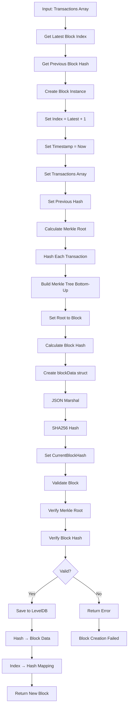

# 🔨 Cách Block Được Tạo - Chi Tiết Implementation

## 📖 Mục Lục

1. [Tổng Quan Block Creation](#tổng-quan-block-creation)
2. [Quy Trình Tạo Block Chi Tiết](#quy-trình-tạo-block-chi-tiết)
3. [Code Implementation](#code-implementation)
4. [Merkle Tree Construction](#merkle-tree-construction)
5. [Block Hash Calculation](#block-hash-calculation)
6. [Validation Process](#validation-process)
7. [Storage Operations](#storage-operations)

---

## 🎯 Tổng Quan Block Creation

Block creation là quá trình **tạo một khối mới** từ tập hợp các transactions hợp lệ. Quá trình này bao gồm:

### ✅ 4 Yêu Cầu Cốt Lõi

1. **📝 Danh sách giao dịch**: Tập hợp transactions hợp lệ
2. **🌳 Merkle Root**: Hash đại diện cho tất cả transactions
3. **🔗 Previous Block Hash**: Liên kết với block trước đó
4. **🔐 Current Block Hash**: Hash duy nhất của block hiện tại

### 🔄 High-Level Process

```
Transactions → Block Creation → Merkle Tree → Hash → Validation → Storage
```

---

## 🏗️ Quy Trình Tạo Block Chi Tiết

### Step 1: Initialize ValidatorNode

```go
// cmd/main.go - Line 379 (demo) hoặc Line 294 (alice-to-bob)
validator, err := validator.NewValidatorNode("./blockchain_data")
```

**Chức năng:**

- Tạo connection tới LevelDB
- Khởi tạo storage layer
- Chuẩn bị để tạo blocks

### Step 2: Prepare Transactions

```go
// cmd/main.go - Line 285-292 (alice-to-bob example)
tx := &blockchain.Transaction{
    Sender:    aliceAddr,
    Receiver:  bobAddr,
    Amount:    amount,
    Timestamp: time.Now().Unix(),
}

// Alice signs transaction
wallet.SignTransaction(tx, alicePriv)
```

**Yêu cầu:**

- Transactions phải được **ký hợp lệ**
- Signature verification pass
- Sender phải có đủ balance (trong implementation đầy đủ)

### Step 3: Call CreateBlock

```go
// cmd/main.go - Line 299
block, err := validator.CreateBlock([]*blockchain.Transaction{tx})
```

**Input:** Array of valid transactions
**Output:** New block với tất cả metadata

---

## 💻 Code Implementation

### 🏛️ ValidatorNode.CreateBlock()

```go
// pkg/validator/node.go - Line 30-58
func (vn *ValidatorNode) CreateBlock(transactions []*blockchain.Transaction) (*blockchain.Block, error) {
    // STEP 1: Lấy hash của block trước đó
    var prevHash []byte
    latestIndex, err := vn.storage.GetLatestIndex()
    if err == nil && latestIndex >= 0 {
        prevBlock, err := vn.storage.GetBlockByIndex(latestIndex)
        if err == nil {
            prevHash = prevBlock.CurrentBlockHash  // Link to previous block
        }
    }

    // STEP 2: Tạo block mới
    newBlock := blockchain.NewBlock(latestIndex+1, transactions, prevHash)

    // STEP 3: Validate block
    if !newBlock.IsValid() {
        return nil, fmt.Errorf("block invalid - Merkle Tree verification failed")
    }

    // STEP 4: Lưu vào database
    if err := vn.storage.SaveBlock(newBlock); err != nil {
        return nil, fmt.Errorf("failed to save block: %w", err)
    }

    // STEP 5: Lưu index mapping
    if err := vn.storage.StoreBlockByIndex(newBlock); err != nil {
        return nil, fmt.Errorf("failed to store block index: %w", err)
    }

    return newBlock, nil
}
```

**Key Points:**

- **Sequential Index**: Blocks được đánh số tuần tự (0, 1, 2, ...)
- **Chain Linking**: Previous hash tạo liên kết chuỗi
- **Validation**: Block phải pass validation trước khi lưu
- **Dual Storage**: Lưu cả hash-based và index-based lookup

### 🏗️ blockchain.NewBlock()

```go
// pkg/blockchain/block.go - Line 20-35
func NewBlock(index int, transactions []*Transaction, prevHash []byte) *Block {
    block := &Block{
        Index:             index,
        Timestamp:         time.Now().Unix(),
        Transactions:      transactions,        // DANH SÁCH GIAO DỊCH
        PreviousBlockHash: prevHash,           // PREVIOUS BLOCK HASH
    }

    // Tính Merkle Root từ transactions
    block.calculateMerkleRoot()

    // Tính Current Block Hash
    block.calculateHash()

    return block
}
```

**Construction Order:**

1. Set basic fields (index, timestamp, transactions, prevHash)
2. Calculate Merkle Root từ transactions
3. Calculate Current Block Hash từ tất cả fields

---

## 🌳 Merkle Tree Construction

### calculateMerkleRoot()

```go
// pkg/blockchain/block.go - Line 37-53
func (b *Block) calculateMerkleRoot() {
    if len(b.Transactions) == 0 {
        b.MerkleRoot = []byte{}
        return
    }

    // Lấy hash của tất cả transactions
    var txHashes [][]byte
    for _, tx := range b.Transactions {
        hash, err := tx.Hash()
        if err != nil {
            continue
        }
        txHashes = append(txHashes, hash)
    }

    // Tạo Merkle Tree và lấy root
    merkleTree := NewMerkleTree(txHashes)
    b.MerkleRoot = merkleTree.GetRoot()
}
```

### NewMerkleTree() Implementation

```go
// pkg/blockchain/merkle.go - Line 12-43
func NewMerkleTree(txHashes [][]byte) *MerkleTree {
    if len(txHashes) == 0 {
        return &MerkleTree{Root: nil}
    }

    nodes := txHashes

    // Build tree bottom-up
    for len(nodes) > 1 {
        var level [][]byte

        for i := 0; i < len(nodes); i += 2 {
            left := nodes[i]
            var right []byte

            if i+1 < len(nodes) {
                right = nodes[i+1]
            } else {
                right = left // Duplicate if odd number
            }

            // Combine and hash
            combined := append(left, right...)
            hash := sha256.Sum256(combined)
            level = append(level, hash[:])
        }
        nodes = level
    }

    return &MerkleTree{Root: nodes[0]}
}
```

**Thuật Toán:**

1. **Bottom-up construction**: Bắt đầu từ transaction hashes
2. **Pair-wise hashing**: Ghép đôi và hash các nodes
3. **Handle odd numbers**: Duplicate node cuối nếu số lẻ
4. **Iterate**: Lặp cho đến khi còn 1 node (root)

**Ví dụ với 4 transactions:**

```
        ROOT
       /    \
    H12      H34
   /  \     /  \
  H1   H2  H3   H4
  |    |   |    |
 TX1  TX2 TX3  TX4
```

---

## 🔐 Block Hash Calculation

### calculateHash()

```go
// pkg/blockchain/block.go - Line 55-74
func (b *Block) calculateHash() {
    // Tạo struct chỉ chứa data cần hash (không bao gồm CurrentBlockHash)
    blockData := struct {
        Index             int            `json:"index"`
        Timestamp         int64          `json:"timestamp"`
        Transactions      []*Transaction `json:"transactions"`
        MerkleRoot        []byte         `json:"merkle_root"`
        PreviousBlockHash []byte         `json:"previous_block_hash"`
    }{
        Index:             b.Index,
        Timestamp:         b.Timestamp,
        Transactions:      b.Transactions,
        MerkleRoot:        b.MerkleRoot,
        PreviousBlockHash: b.PreviousBlockHash,
    }

    data, err := json.Marshal(blockData)
    if err != nil {
        return
    }

    hash := sha256.Sum256(data)
    b.CurrentBlockHash = hash[:]
}
```

**Tại sao không hash CurrentBlockHash?**

- **Circular Reference**: CurrentBlockHash là kết quả của việc hash, không thể hash chính nó
- **Deterministic**: Cùng block data → cùng hash output

**Hash Input Fields:**

- Index (block height)
- Timestamp
- Transactions (full transaction data)
- MerkleRoot (32 bytes)
- PreviousBlockHash (32 bytes)

---

## ✅ Validation Process

### Block.IsValid()

```go
// pkg/blockchain/block.go - Line 76-108
func (b *Block) IsValid() bool {
    // 1. Kiểm tra Merkle Root integrity
    var txHashes [][]byte
    for _, tx := range b.Transactions {
        hash, err := tx.Hash()
        if err != nil {
            return false
        }
        txHashes = append(txHashes, hash)
    }

    merkleTree := NewMerkleTree(txHashes)
    calculatedRoot := merkleTree.GetRoot()

    // So sánh calculated vs stored Merkle Root
    if len(calculatedRoot) != len(b.MerkleRoot) {
        return false
    }
    for i := range calculatedRoot {
        if calculatedRoot[i] != b.MerkleRoot[i] {
            return false
        }
    }

    // 2. Kiểm tra Current Block Hash integrity
    originalHash := make([]byte, len(b.CurrentBlockHash))
    copy(originalHash, b.CurrentBlockHash)

    b.calculateHash()

    for i := range originalHash {
        if originalHash[i] != b.CurrentBlockHash[i] {
            return false
        }
    }

    return true
}
```

**Validation Steps:**

1. **Merkle Root Check**: Tính lại Merkle Root và so sánh
2. **Block Hash Check**: Tính lại block hash và so sánh
3. **Data Integrity**: Đảm bảo không có dữ liệu bị thay đổi

---

## 💾 Storage Operations

### SaveBlock() - Primary Storage

```go
// pkg/storage/leveldb.go - Line 28-37
func (bs *BlockStorage) SaveBlock(block *blockchain.Block) error {
    blockBytes, err := json.Marshal(block)
    if err != nil {
        return fmt.Errorf("failed to marshal block: %w", err)
    }

    // Sử dụng CurrentBlockHash làm key
    return bs.db.Put(block.CurrentBlockHash, blockBytes, nil)
}
```

**Key Strategy:**

- **Hash as Key**: Block hash làm primary key
- **JSON Serialization**: Block → JSON → bytes
- **Unique Keys**: Mỗi block có hash duy nhất

### StoreBlockByIndex() - Secondary Index

```go
// pkg/storage/leveldb.go - Line 55-60
func (bs *BlockStorage) StoreBlockByIndex(block *blockchain.Block) error {
    key := "height_" + strconv.Itoa(block.Index)

    // Chỉ lưu hash, không lưu toàn bộ block để tiết kiệm space
    return bs.db.Put([]byte(key), block.CurrentBlockHash, nil)
}
```

**Index Strategy:**

- **Height → Hash**: Mapping từ block height → block hash
- **Space Efficient**: Chỉ lưu 32 bytes hash, không duplicate data
- **Fast Lookup**: Tìm block theo index O(1)

---

## 🔄 Complete Flow Diagram



## 📊 Performance Metrics

### Timing Analysis (approximate)

- **Merkle Tree**: 1-5ms (depending on transaction count)
- **Block Hash**: <1ms (SHA256 of JSON)
- **Validation**: 2-10ms (re-calculate + compare)
- **Database Write**: 1-5ms (LevelDB operations)
- **Total**: 5-20ms per block

### Memory Usage

- **Block Size**: 500-2000 bytes (depends on transactions)
- **Transaction**: ~200 bytes each
- **Merkle Tree**: O(n) memory for n transactions
- **Total**: Linear with transaction count

### Scalability Considerations

- **Single Transaction**: ~1MB/day for 1 tx/minute
- **High Volume**: Scales linearly với transaction count
- **Database**: LevelDB handles GBs of data efficiently
- **Bottleneck**: Disk I/O becomes limiting factor

## 🔐 Security Features

### Cryptographic Security

- **SHA-256**: Industry standard, collision resistant
- **ECDSA**: Elliptic curve signatures, 256-bit security
- **Merkle Trees**: Tamper-evident data structure
- **Hash Chain**: Previous hash linking provides immutability

### Validation Security

- **Double Hashing**: Hash transactions, then hash block
- **Signature Verification**: Every transaction signed và verified
- **Merkle Proof**: Can prove transaction inclusion without full block
- **Chain Integrity**: Changing any block breaks subsequent blocks

## 🚀 Next Steps & Improvements

### Production Enhancements

1. **Proof of Work**: Add mining difficulty và nonce
2. **Transaction Pool**: Queue pending transactions
3. **Network Protocol**: Broadcast blocks to peers
4. **Consensus**: Handle forks và longest chain rule
5. **UTXO Model**: Replace balance-based với unspent outputs

### Performance Optimizations

1. **Parallel Processing**: Concurrent Merkle tree construction
2. **Caching**: Cache recent blocks in memory
3. **Batch Operations**: Group multiple transactions
4. **Compression**: Compress block data before storage
5. **Pruning**: Archive old blocks để save space
