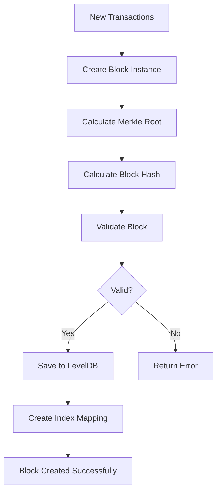

# 💾 Blockchain Data Structure Documentation

## 📖 Mục Lục

1. [Tổng Quan Data Storage](#tổng-quan-data-storage)
2. [Block Structure](#block-structure)
3. [LevelDB Database Structure](#leveldb-database-structure)
4. [Key-Value Mapping](#key-value-mapping)
5. [File Structure Chi Tiết](#file-structure-chi-tiết)
6. [Code Implementation](#code-implementation)
7. [Data Flow](#data-flow)

---

## 🎯 Tổng Quan Data Storage

Blockchain này sử dụng **LevelDB** - một embedded key-value database để lưu trữ:

- **📦 Blocks** - Các khối chứa danh sách transactions
- **🔗 Index mapping** - Mapping từ block height → block hash
- **🌳 Merkle Trees** - Xác thực tính toàn vẹn transactions
- **🔐 Signatures** - Chữ ký ECDSA cho mỗi transaction

### Code Location:

```go
// pkg/storage/leveldb.go - Line 19-26
func NewBlockStorage(dbPath string) (*BlockStorage, error) {
    db, err := leveldb.OpenFile(dbPath, nil)  // ← Tạo/mở database folder
    if err != nil {
        return nil, fmt.Errorf("failed to open leveldb: %w", err)
    }
    return &BlockStorage{db: db}, nil
}
```

---

## 📦 Block Structure

### Block Data Structure

```go
type Block struct {
    Index             int            `json:"index"`              // Block height
    Timestamp         int64          `json:"timestamp"`          // Unix timestamp
    Transactions      []*Transaction `json:"transactions"`       // DANH SÁCH GIAO DỊCH
    MerkleRoot        []byte         `json:"merkle_root"`        // Merkle tree root
    PreviousBlockHash []byte         `json:"previous_block_hash"`// Link to previous block
    CurrentBlockHash  []byte         `json:"current_block_hash"` // This block's hash
}
```

**🎯 4 Yêu Cầu Cốt Lõi được implement:**

1. **📝 Danh sách giao dịch** - `Transactions` field
2. **🌳 Merkle Root** - `MerkleRoot` field
3. **🔗 Previous Block Hash** - `PreviousBlockHash` field
4. **🔐 Current Block Hash** - `CurrentBlockHash` field

### Transaction Structure

```go
type Transaction struct {
    Sender    []byte  // Address của người gửi (20 bytes)
    Receiver  []byte  // Address của người nhận (20 bytes)
    Amount    float64 // Số tiền
    Timestamp int64   // Thời gian tạo transaction
    Signature []byte  // ECDSA signature (r + s)
}
```

---

## 🗂️ LevelDB Database Structure

### Database Directories Created:

```
blockchain_data/          ← Main blockchain (production)
demo_blockchain/          ← Demo blockchain (testing)
```

### Folder Structure:

```
demo_blockchain/          ← Database directory
├── 000004.log          ← Write-ahead log (actual data)
├── CURRENT             ← Active manifest pointer
├── CURRENT.bak         ← Backup of CURRENT
├── LOCK                ← Process lock file
├── LOG                 ← Operation logs
└── MANIFEST-000005     ← Database metadata
```

### Code Location:

```go
// cmd/main.go - Line 379 (runAliceBobDemo)
validator, err := validator.NewValidatorNode("./demo_blockchain")

// cmd/main.go - Line 294 (aliceToBobTransaction)
validator, err := validator.NewValidatorNode("./blockchain_data")

// pkg/validator/node.go - Line 19-26
func NewValidatorNode(dbPath string) (*ValidatorNode, error) {
    storage, err := storage.NewBlockStorage(dbPath)  // ← Tạo folder này
    if err != nil {
        return nil, fmt.Errorf("failed to create storage: %w", err)
    }
    return &ValidatorNode{storage: storage}, nil
}
```

---

## 🔑 Key-Value Mapping

LevelDB lưu data dưới dạng **key-value pairs**:

### 1. Block Storage (Primary)

```
Key:   [block_hash]           (32 bytes SHA256)
Value: [serialized_block]     (JSON của Block struct)

Example:
Key:   a1b2c3d4e5f6789abcdef...
Value: {"index":0,"timestamp":1672531200,"transactions":[...],...}
```

### 2. Index Mapping (Secondary)

```
Key:   "height_0", "height_1", "height_2"...
Value: [block_hash]           (32 bytes)

Example:
Key:   "height_0"
Value: a1b2c3d4e5f6789abcdef...
```

**Dual Storage Benefits:**

- **Hash-based lookup**: Truy cập trực tiếp bằng block hash O(1)
- **Index-based lookup**: Tìm block theo height O(1)
- **Space efficient**: Index chỉ lưu hash, không duplicate data

### Code Implementation:

```go
// pkg/storage/leveldb.go - Line 28-37
func (bs *BlockStorage) SaveBlock(block *blockchain.Block) error {
    // 1. Serialize block thành JSON
    blockBytes, err := json.Marshal(block)
    if err != nil {
        return fmt.Errorf("failed to marshal block: %w", err)
    }

    // 2. Lưu với key = block hash
    return bs.db.Put(block.CurrentBlockHash, blockBytes, nil)
}

// pkg/storage/leveldb.go - Line 55-60
func (bs *BlockStorage) StoreBlockByIndex(block *blockchain.Block) error {
    key := "height_" + strconv.Itoa(block.Index)

    // Chỉ lưu hash, không lưu toàn bộ block để tiết kiệm space
    return bs.db.Put([]byte(key), block.CurrentBlockHash, nil)
}
```

## 📁 File Structure Chi Tiết

### Real Data Files sau khi chạy demo:

```
blockchain-go/
├── 🔧 cli.exe                     # Built executable
├── 🔑 alice_key.json              # Alice's wallet
├── 🔑 bob_key.json                # Bob's wallet
├── 📁 blockchain_data/            # Main database
│   ├── 000004.log                 # Data file
│   ├── CURRENT                    # Manifest pointer
│   ├── CURRENT.bak               # Backup
│   ├── LOCK                      # Lock file
│   ├── LOG                       # Operation log
│   └── MANIFEST-000005           # Metadata
├── 📁 demo_blockchain/           # Demo database
│   ├── 000004.log               # Data file
│   ├── CURRENT                  # Manifest pointer
│   ├── CURRENT.bak             # Backup
│   ├── LOCK                    # Lock file
│   ├── LOG                     # Operation log
│   └── MANIFEST-000005         # Metadata
└── 📄 *.md files               # Documentation
```

### Key Files Explained:

**🔑 Wallet Files (.json)**

```json
{
  "private_key": "a1b2c3d4e5f6...",
  "public_key_x": "b2c3d4e5f6g7...",
  "public_key_y": "c3d4e5f6g7h8..."
}
```

**📦 Block Data (trong .log files)**

```json
{
  "index": 0,
  "timestamp": 1672531200,
  "transactions": [
    {
      "sender": "a1b2c3d4...",
      "receiver": "b2c3d4e5...",
      "amount": 50.0,
      "timestamp": 1672531200,
      "signature": "r_bytes + s_bytes"
    }
  ],
  "merkle_root": "f6g7h8i9...",
  "previous_block_hash": null,
  "current_block_hash": "e5f6g7h8..."
}
```

    // 3. Lưu index mapping: "index_0" → block_hash
    indexKey := []byte(fmt.Sprintf("index_%d", block.Index))
    return ldb.db.Put(indexKey, key, nil)

}

```

---

## 📄 File Structure Chi Tiết

### 1. **LOCK File**

```

File: demo_blockchain/LOCK
Content: (empty file)
Purpose: Prevent concurrent access

````

**Code tạo ra:**

```go
// Khi gọi leveldb.OpenFile() - internal LevelDB code
// Tự động tạo LOCK file để prevent multiple processes
````

### 2. **CURRENT File**

```
File: demo_blockchain/CURRENT
Content: MANIFEST-000000
Purpose: Points to active manifest file
```

### 3. **MANIFEST-000000 File**

```
File: demo_blockchain/MANIFEST-000000
Content: Binary metadata
Contains:
- Comparator: leveldb.BytewiseComparator
- Database version info
- Level structure metadata
```

### 4. **LOG File**

```
File: demo_blockchain/LOG
Content: Text logs
Example:
=============== Jun 19, 2025 (+07) ===============
15:49:25.268762 db@open opening
15:49:25.269796 version@stat F·[] S·0B[] Sc·[]
15:49:25.271868 db@open done T·3.1059ms
```

**Giải thích log entries:**

- `db@open opening` - Database being opened
- `version@stat F·[] S·0B[]` - No files, 0 bytes
- `db@open done T·3.1059ms` - Opened in 3.1ms

### 5. **000001.log File (Write-Ahead Log)**

```
File: demo_blockchain/000001.log
Content: Binary data
Contains: Actual block data before compaction
```

---

## 💻 Code Implementation Details

### Block Data Structure:

```go
// pkg/blockchain/block.go - Line 8-15
type Block struct {
    Index             int            `json:"index"`              // Block number
    Timestamp         int64          `json:"timestamp"`          // Unix timestamp
    Transactions      []*Transaction `json:"transactions"`       // List of txs
    MerkleRoot        []byte         `json:"merkle_root"`        // Merkle tree root
    PreviousBlockHash []byte         `json:"previous_block_hash"` // Previous block hash
    CurrentBlockHash  []byte         `json:"current_block_hash"`  // This block hash
}
```

### Serialized Block Example:

```json
{
  "index": 0,
  "timestamp": 1640995200,
  "transactions": [
    {
      "sender": "4d47ace7bbcdde1ec0dda61bf0600f3c22221dbc",
      "receiver": "437c6e08e2fc87d08d056b8db9fc174fe003560d",
      "amount": 50.0,
      "timestamp": 1640995200,
      "signature": "1a2b3c4d5e6f7890abcdef..."
    }
  ],
  "merkle_root": "9250bad8341649f09e8bdf0b48135750b6ce51dcb6ccbc446dbaae035053e66c",
  "previous_block_hash": null,
  "current_block_hash": "d9050ddddd56fb958e1e3a7e7f3386ef90d62b36726896ec561e808072664d94"
}
```

### Save Process Code:

```go
// pkg/validator/node.go - Line 65-85
func (vn *ValidatorNode) CreateBlock(transactions []*blockchain.Transaction) (*blockchain.Block, error) {
    // ... validation code ...

    // Tạo block mới
    newBlock := &blockchain.Block{
        Index:             vn.currentIndex,
        Timestamp:         time.Now().Unix(),
        Transactions:      transactions,
        MerkleRoot:        merkleTree.Root.Data,      // ← Merkle root
        PreviousBlockHash: vn.getLastBlockHash(),     // ← Chain linking
    }

    // Tính hash cho block
    newBlock.CurrentBlockHash = newBlock.Hash()       // ← Block hash

    // Lưu vào database
    if err := vn.storage.SaveBlock(newBlock); err != nil {  // ← Save to LevelDB
        return nil, fmt.Errorf("failed to save block: %w", err)
    }

    return newBlock, nil
}
```

---

## 🔄 Data Flow

### 1. Block Creation Flow



### 2. Database Write Operations

```go
// Step 1: Create block with transactions
block := blockchain.NewBlock(index, transactions, prevHash)

// Step 2: Validate (Merkle Tree + Hash verification)
if !block.IsValid() {
    return error
}

// Step 3: Save block data
bs.db.Put(block.CurrentBlockHash, blockJSON, nil)

// Step 4: Save index mapping
key := "height_" + strconv.Itoa(block.Index)
bs.db.Put([]byte(key), block.CurrentBlockHash, nil)
```

### 3. Database Read Operations

#### Get Block by Hash

```go
// pkg/storage/leveldb.go - Line 39-51
func (bs *BlockStorage) GetBlock(hash []byte) (*blockchain.Block, error) {
    blockBytes, err := bs.db.Get(hash, nil)
    if err != nil {
        return nil, fmt.Errorf("failed to get block: %w", err)
    }

    var block blockchain.Block
    if err := json.Unmarshal(blockBytes, &block); err != nil {
        return nil, fmt.Errorf("failed to unmarshal block: %w", err)
    }

    return &block, nil
}
```

#### Get Block by Index

```go
// pkg/storage/leveldb.go - Line 63-72
func (bs *BlockStorage) GetBlockByIndex(index int) (*blockchain.Block, error) {
    key := "height_" + strconv.Itoa(index)
    hash, err := bs.db.Get([]byte(key), nil)
    if err != nil {
        return nil, fmt.Errorf("failed to get block hash by index: %w", err)
    }

    // Sau đó lấy block bằng hash
    return bs.GetBlock(hash)
}
```

## 📊 Storage Statistics

### Database Size Analysis

```bash
# Sau khi chạy demo với 2 blocks:
demo_blockchain/
├── 000004.log    (~2KB)  # Chứa 2 blocks + metadata
├── CURRENT       (16B)   # Manifest pointer
├── LOCK          (0B)    # Lock file
├── LOG           (~1KB)  # Operation logs
└── MANIFEST-*    (~1KB)  # Database metadata

Total: ~4KB cho 2 blocks
```

### Storage Efficiency

- **Block size**: ~500-1000 bytes per block (tùy số transactions)
- **Index overhead**: 32 bytes per block (chỉ hash)
- **Compression**: LevelDB tự động compress data
- **Disk I/O**: Batch writes cho hiệu suất cao

### Data Retrieval Performance

- **By Hash**: O(1) - Direct key lookup
- **By Index**: O(1) - Index → Hash → Block (2 lookups)
- **Latest Block**: O(n) - Scan all "height\_\*" keys (có thể optimize)
- **Range Query**: O(log n) - LevelDB iterator support

## 🔧 Database Operations

### Core Operations trong Code

#### Create & Save Block

```go
// pkg/validator/node.go - Line 30-58
func (vn *ValidatorNode) CreateBlock(transactions []*blockchain.Transaction) (*blockchain.Block, error) {
    // Get previous block hash
    var prevHash []byte
    latestIndex, err := vn.storage.GetLatestIndex()
    if err == nil && latestIndex >= 0 {
        prevBlock, err := vn.storage.GetBlockByIndex(latestIndex)
        if err == nil {
            prevHash = prevBlock.CurrentBlockHash
        }
    }

    // Create new block
    newBlock := blockchain.NewBlock(latestIndex+1, transactions, prevHash)

    // Validate với Merkle Tree
    if !newBlock.IsValid() {
        return nil, fmt.Errorf("block invalid - Merkle Tree verification failed")
    }

    // Save to database
    if err := vn.storage.SaveBlock(newBlock); err != nil {
        return nil, fmt.Errorf("failed to save block: %w", err)
    }

    // Save index mapping
    if err := vn.storage.StoreBlockByIndex(newBlock); err != nil {
        return nil, fmt.Errorf("failed to store block index: %w", err)
    }

    return newBlock, nil
}
```

#### Get Latest Block Index

```go
// pkg/storage/leveldb.go - Line 75-89
func (bs *BlockStorage) GetLatestIndex() (int, error) {
    iter := bs.db.NewIterator(nil, nil)
    defer iter.Release()

    latestIndex := -1
    for iter.Next() {
        key := string(iter.Key())
        if len(key) > 7 && key[:7] == "height_" {
            index, err := strconv.Atoi(key[7:])
            if err == nil && index > latestIndex {
                latestIndex = index
            }
        }
    }

    return latestIndex, nil
}
```

## 🔐 Data Integrity & Security

### Merkle Tree Validation

```go
// pkg/blockchain/block.go - Line 75-108
func (b *Block) IsValid() bool {
    // 1. Verify Merkle Root integrity
    var txHashes [][]byte
    for _, tx := range b.Transactions {
        hash, err := tx.Hash()
        if err != nil {
            return false
        }
        txHashes = append(txHashes, hash)
    }

    merkleTree := NewMerkleTree(txHashes)
    calculatedRoot := merkleTree.GetRoot()

    // Compare calculated vs stored Merkle Root
    if !bytes.Equal(calculatedRoot, b.MerkleRoot) {
        return false
    }

    // 2. Verify Block Hash integrity
    originalHash := make([]byte, len(b.CurrentBlockHash))
    copy(originalHash, b.CurrentBlockHash)

    b.calculateHash()

    if !bytes.Equal(originalHash, b.CurrentBlockHash) {
        return false
    }

    return true
}
```

### Transaction Signature Verification

```go
// pkg/wallet/sign.go - Line 23-29
func VerifyTransaction(tx *blockchain.Transaction, pubKey *ecdsa.PublicKey) bool {
    hash, _ := tx.Hash()
    r := new(big.Int).SetBytes(tx.Signature[:len(tx.Signature)/2])
    s := new(big.Int).SetBytes(tx.Signature[len(tx.Signature)/2:])
    return ecdsa.Verify(pubKey, hash, r, s)
}
```

## 🚀 Performance Considerations

### Optimization Strategies

1. **Batch Operations**: Group multiple writes
2. **Index Caching**: Cache latest block index in memory
3. **Bloom Filters**: Fast existence checks
4. **Compression**: LevelDB built-in compression

### Scalability Limits

- **Single Machine**: LevelDB không support clustering
- **Disk Space**: Linear growth với số blocks
- **Memory**: O(1) memory per operation
- **Concurrent Access**: Thread-safe qua LevelDB locks

### Production Recommendations

1. **Backup Strategy**: Regular backup của database folders
2. **Monitoring**: Track database size và performance metrics
3. **Archival**: Archive old blocks nếu cần
4. **Sharding**: Split database khi quá lớn
